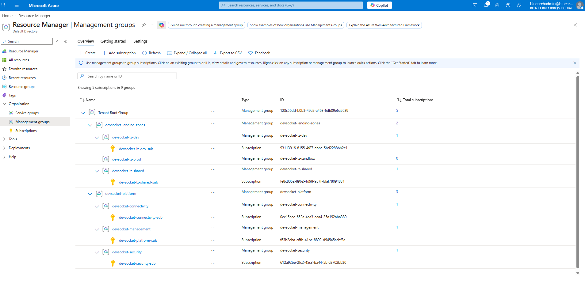
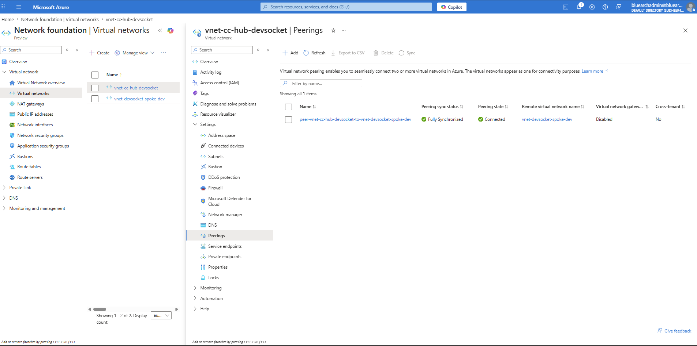
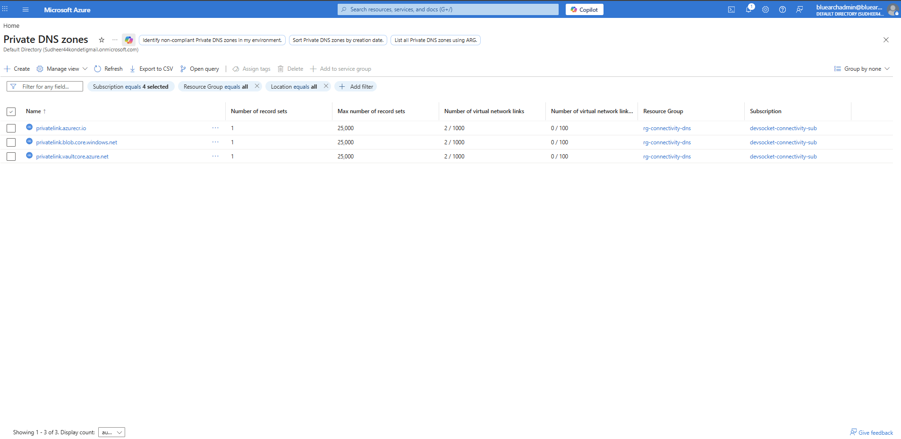
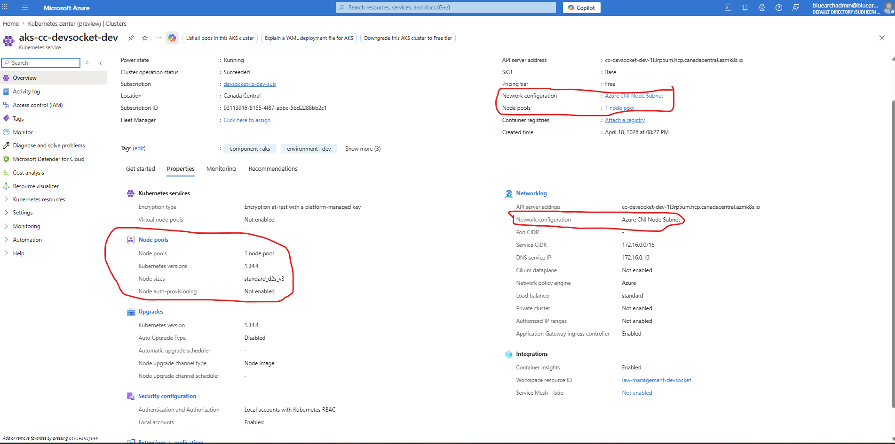
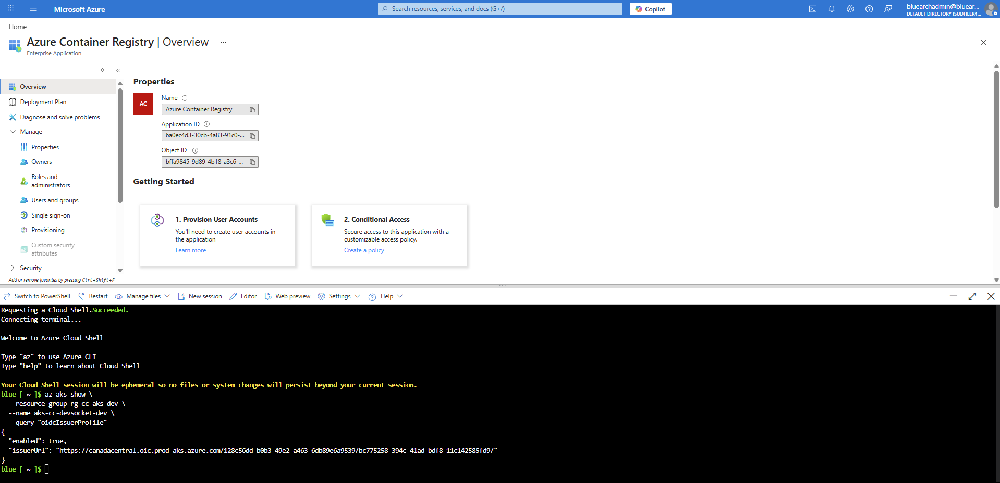
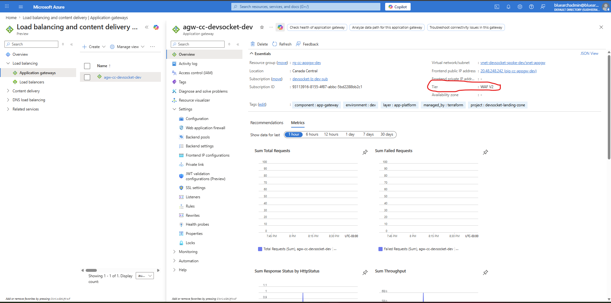
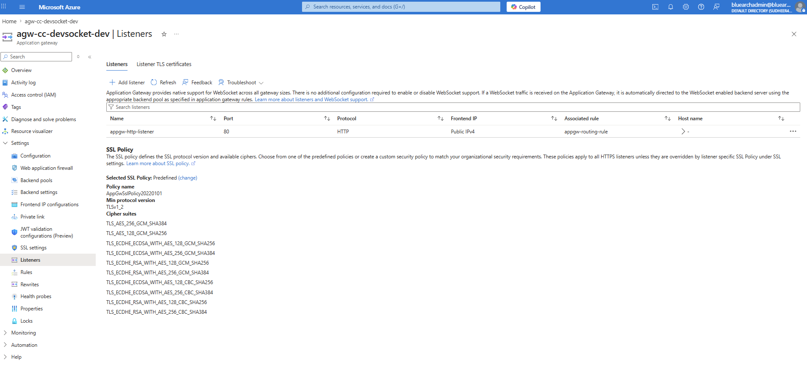
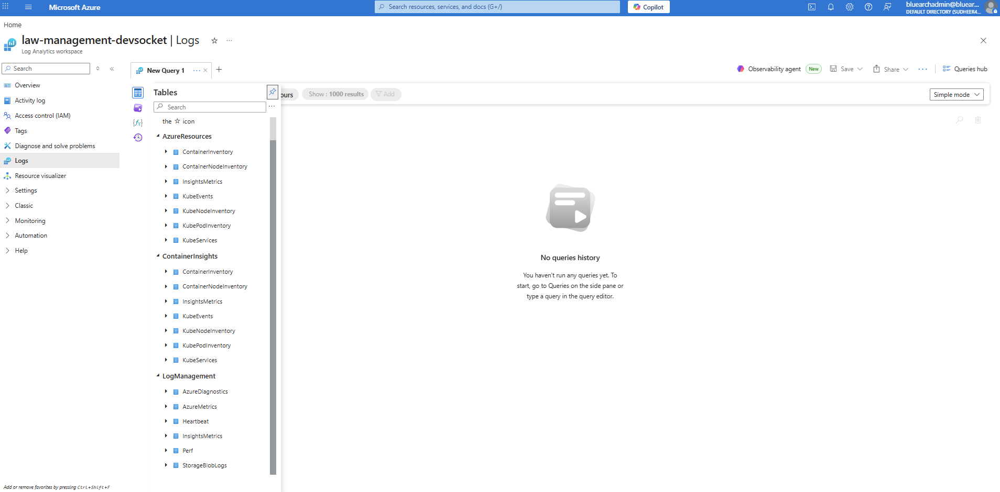

## Deployment Captures

The following screenshots are from a live deployment of this setup.

### Management Groups & Subscriptions

### Hub-Spoke Networking

### Private DNS Zones

### AKS Cluster

### Application Gateway (WAF)

### Observability (Log Analytics)
